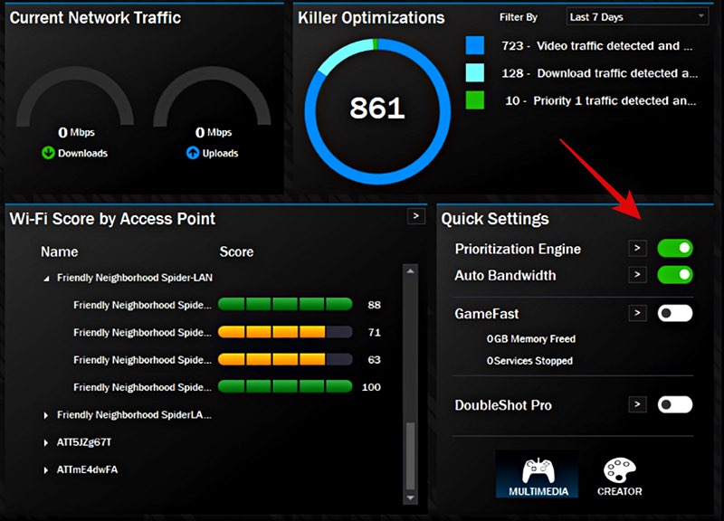

# Lỗi %core máy nhà

Trước tiên bạn phải kiểm tra xem máy đã cài đặt đẩy đủ driver chưa, cách kiểm tra và cài đặt driver đã có ở mục[ Lỗi khi bật ứng dụng Tiny](loi-khi-bat-ung-dung-tiny.md).

Nếu đã update đầy đủ driver mà vẫn bị lỗi thì bạn có thể tham khảo các cách bên dưới

## Trường hợp bạn vừa mới nạp tiền vào tài khoản Tiny

Khi bạn mới nạp tiền vào tài khoản thì bên ứng dụng và hệ thống sẽ cần 1 chút thời gian để đồng bộ, nếu bạn mới gia hạn và bị lỗi này thì bạn chỉ cần chờ khoản 30 giây rồi kết nối lại là đươc.

## Trường hợp máy của bạn sử dụng card mạng Killer

#### Bước 1 : Kiểm tra xem máy bạn có sử dụng card mạng Killer không&#x20;

Các bạn nhấn Windows, sau đó gõ "device manager" rồi nhấn Enter, trong cửa sổ mới mở ra các bạn chọn mục "network adapter", trong mục này nếu các bạn thấy có dòng Killer tương tự như hình thì tức là máy bạn đang sử dụng card mạng Killer, còn nếu không thì các bạn có thể bỏ qua cách này và tham khảo [các cách bên dưới ](loi-core-may-nha.md#truong-hop-may-ban-khong-su-dung-card-mang-killer)

<figure><figcaption></figcaption></figure>

#### Bước 2 : Sau khi đã xác định được là máy bạn sử dụng card mạng Killer, thì các bạn vào app killer intelligence center để tắt các mục như hình bên dưới, nếu máy bạn chưa có app thì bạn có thể tải trên trang chủ của Intel&#x20;

<figure><figcaption></figcaption></figure>

## Trường hợp máy bạn không sử dụng card mạng Killer

#### Cách 1: Tắt ipv6&#x20;

Bạn tìm kiếm **Control Panel -> View network status and tasks ->** **Ethernet -> Properties ->**

<figure><figcaption></figcaption></figure>

<figure><figcaption></figcaption></figure>

<figure><figcaption></figcaption></figure>

.png>) ->.png>)-> **OK.**

#### &#x20;Cách 2 : Làm tương tự như [**Lỗi khi bật ứng dụng tiny.**](loi-khi-bat-ung-dung-tiny.md)
