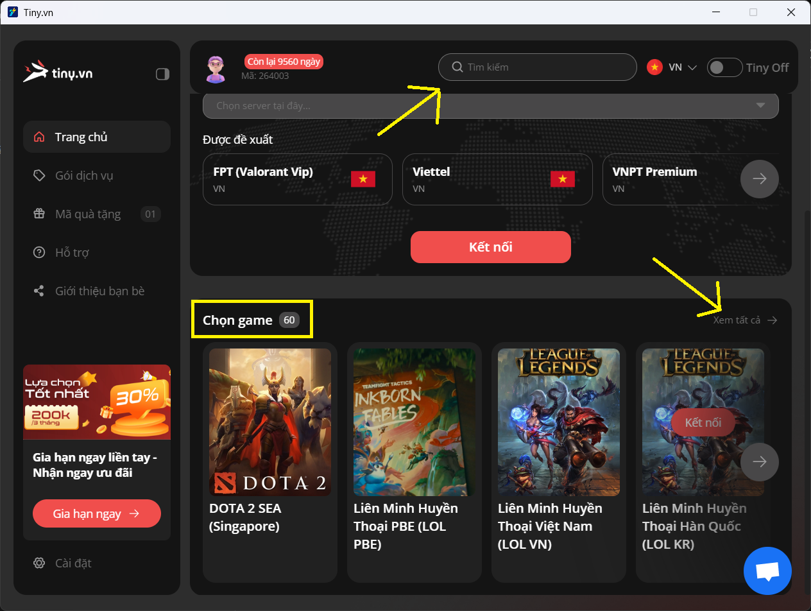

# Kết Nối

1.  Kiểm tra mục "Chọn game" hoặc "tìm kiếm" xem game bạn chơi có ở đó không. Nếu có, chọn kết nối.

    <figure><figcaption></figcaption></figure>
2.  Nếu game bạn chơi không có trong mục chọn game. Vào mục "Chọn server" -> Tìm và chọn server phù hợp với game bạn chơi -> kết nối

    <figure><figcaption></figcaption></figure>
3.  Khi bạn kết nối đến 1 server bất kỳ, nếu có dòng chữ "Đã kết nối -"Tên server"" Thì tức là bạn đã kết nối thành công với server của Tiny. Khi này, bạn có thể mở game và chơi như bình thường.

    <figure><figcaption></figcaption></figure>

### Làm sao để biết server nào là server phù hợp với game mà bạn chơi.

#### **Nếu bạn biết game mình chơi có server đặt ở đâu**

Thì bạn chỉ cần kết nối server Tiny gần với server game mà bạn chơi nhất hoặc liên hệ với CSKH của Tiny để được tư vấn server phù hợp.

#### **Nếu bạn không biết game mình chơi có server ở đâu**

Bạn có thể làm theo các bước sau :

* Bước 1: Mở Game mà bạn đang cần lấy IP
* Bước 2: Tải phầm mềm CurrPorts Link Download: https://www.nirsoft.net/utils/cports.zip
*   Bước 3: Mở phầm mềm CurrPorts và bạn sẽ thấy IP của game mà bạn đang chơi

    Khi đã thấy được IP, bạn có thể kiểm tra bằng cách nhập địa chỉ IP trên vào trang web : http://ip-api.com hoặc gửi trực tiếp IP cho CSKH của Tiny để bên mình hổ trợ tìm server phù hợp giúp bạn.

Ví dụ :

<figure><figcaption></figcaption></figure>

Ở đây, IP của game so2game là 103.90.224.10

<figure><figcaption></figcaption></figure>

Nhập IP vừa lấy được vào trang web http://ip-api.com rồi chọn SEARCH

<figure><figcaption></figcaption></figure>

Khi này, trang web sẽ hiễn thị các thông tin của địa chỉ IP mà bạn vừa nhập. Ở đây, IP có địa chỉ là Tp.Hồ Chí Minh, Việt Nam -> kết nối server Ho Chi Minh City của Tiny -> vào game
